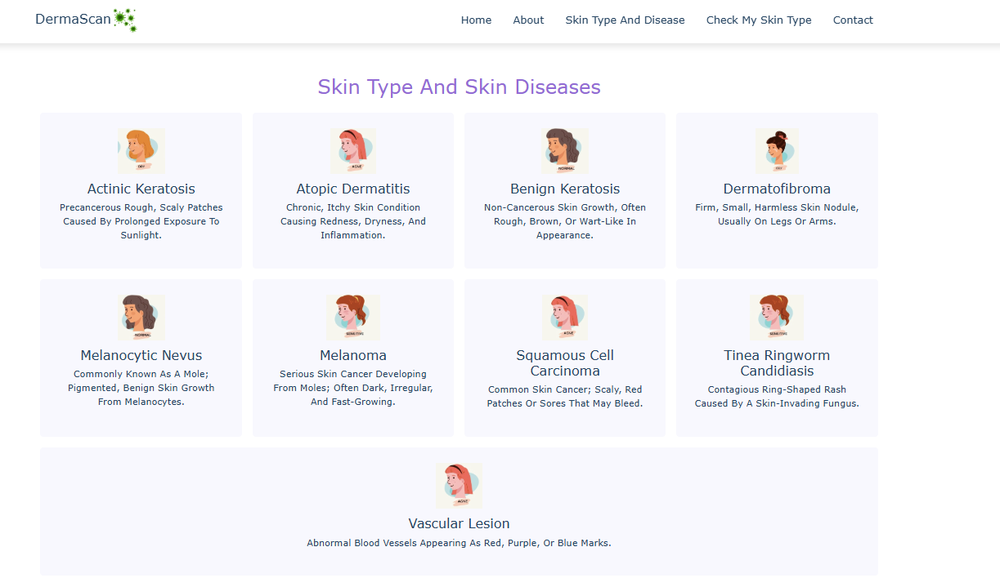
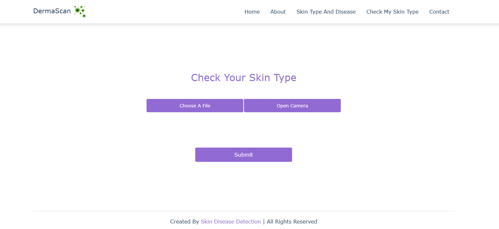
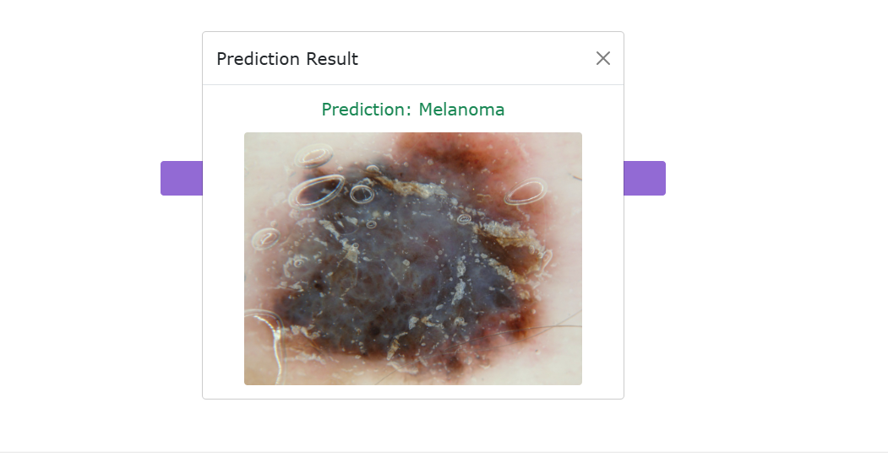

# 🌿 Dermalyze – Skin Disease Detection


---

## 📋 Table of Contents
- [About the Project](#about-the-project)
- [Features](#features)
- [Tech Stack](#tech-stack)
- [Getting Started](#getting-started)
- [How to Use](#how-to-use)
- [Screenshots](#screenshots)
- [Credits](#credits)


---

## 📖 About the Project

**Dermalyze** is a Flask-based web app that detects skin diseases and classifies skin types using a deep learning model. Users can upload an image or use their webcam, and the system predicts the skin disease or type in real-time.

---

## 🚀 Features

- 🧠 Deep Learning-based skin disease prediction
- 📷 Upload image or capture via webcam
- 📱 Fully responsive UI
- 📊 Dynamic result display with image preview
- 🌍 Google Maps embedded for contact location

---

## 🔧 Tech Stack

- **Frontend**: HTML, CSS, JavaScript, Bootstrap
- **Backend**: Python, Flask
- **ML/DL**: TensorFlow, Keras, RestNet50

---

## 🛠️ Getting Started

### Clone the repository
```bash
git clone https://github.com/your-username/dermalyze.git
cd dermalyze
```
### Install dependencies

```bash
pip install -r requirements.txt 
```

### Run the app

```bash
python app.py
```
---

# 📸 Screenshots

### disease types

 

### Prediction Page 
 

 ### result
 


---


# 📁 Project Structure

    dermalyze/
    │
    ├── static/
    │   ├── style.css
    │   ├── main.js
    │   └── Images/
    │
    ├── templates/
    │   ├── index.html
    │   ├── about.html
    │   ├── contact.html
    │   ├── prediction.html
    │   └── disease.html
    │
    ├
    │── resnet50_model.h5
    ├── app.py
    ├── requirements.txt
    └── README.md


---

## 💡 How to Use

1. Open the app in browser.

2. Navigate to "Check My Skin Type".

3. Upload an image or use the Open Camera button.

4. Click Submit.

5. View prediction result in a modal popup.


---

